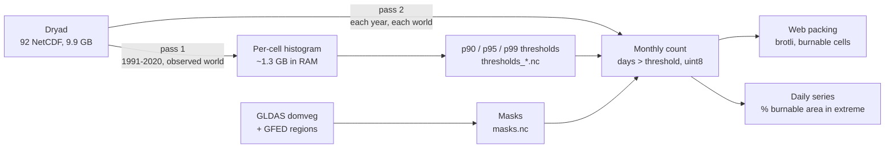

# 00: Pipeline overview

> Goal: turn ~10 GB of daily NetCDF into a few dozen MB the browser can animate,
> without betraying the science behind it.

## What we're visualizing

Not "the number of fires," but **fire weather itself**: the Canadian system's *Fire
Weather Index* (FWI), computed daily on a 0.25° global grid (~28 km at the equator) from
ERA5 reanalysis maximum temperature, minimum humidity, wind and precipitation. Two worlds
are compared:

| World | Content | Source |
|---|---|---|
| **observed** | FWI recomputed on ERA5 | Yin et al. 2026, `fwi_era5_YYYY.nc` files |
| **counterfactual** | the same, with the human-caused warming signal removed (mean of 20 CMIP6 models, 1850-1900 reference, smoothed over 20 years) | `fwi_era5_counter_YYYY.nc` files |

A day is "extreme" in a cell when its FWI exceeds the **local 90th percentile computed
over 1991-2020** (the paper's definition). The same threshold is applied to both worlds:
that's what makes the comparison legible. We also compute p95 and p99 for visual tiers.

## The two passes

The volume rules out loading everything into memory: 46 years x 365 days x 1,038,240
cells is about 17 billion values per world. The pipeline therefore reads each file
**once per pass**, day by day, never materializing more than 32 days at a time.



1. **Pass 1: thresholds** (`earthburns thresholds`): a fixed-bin histogram per cell, fed
   day after day, from which percentiles are derived with an error bounded by bin width.
   Detail: [03-thresholds.md](03-thresholds.md).
2. **Masks** (`earthburns mask`): which cells are "burnable" (forests, savannas,
   shrublands, grasslands...) and which GFED region they belong to.
   Detail: [02-grid-and-masks.md](02-grid-and-masks.md).
3. **Pass 2: counting** (`earthburns monthly`): for each month, each cell and each
   threshold, the number of days above the threshold (one byte), plus, for each day, the
   fraction of burnable land in extreme fire weather, globally and by region.
   Detail: [04-monthly-and-extent.md](04-monthly-and-extent.md).
4. **Packing** (`earthburns pack`): burnable cells only, monthly frames, brotli-compressed
   by decade. Detail: [05-web-packing.md](05-web-packing.md).

## Layout

```
config/pipeline.toml      settings (paths, years, quantiles, burnable classes)
earthburns/               the Python package
  grid.py                 canonical 721x1440 grid, cos(lat) weights, reorientation
  fwi_io.py               lazy NetCDF reading, day-by-day iteration
  histogram.py            streaming histogram + percentiles
  thresholds.py           pass 1 (orchestration + validation)
  mask.py / build_mask.py burnable mask + GFED regions
  monthly.py / monthly_run.py  pass 2
  extent.py               weighted area fractions
  pack.py                 web encoding
  dryad.py / cli_dryad.py Dryad client (manifest, resume, SHA-256)
  cli.py                  commands
tests/                    57 unit and integration tests (pytest)
data/                     never versioned: raw/ -> interim/ -> processed/ -> web/
```

## Choices that shape everything else

- **Canonical grid**: latitude from +90 to -90, longitude from -180 to +179.75. Every
  array the pipeline produces has this orientation, which lets masks, thresholds and
  daily counts line up cell by cell with no reindexing.
- **Immutable except accumulators**: functions return new arrays; only the histogram and
  the monthly counter update in place, because that's what keeps them within memory.
- **Fail fast**: a missing file, an unexpected grid, an incomplete year, a wrong
  checksum → an exception, never a silent default value.

## Main sources

- Yin C., Abatzoglou J. T., Jones M. W. et al., *Increasing synchronicity of global extreme
  fire weather*, Science Advances, February 18, 2026, doi:[10.1126/sciadv.adx8813](https://doi.org/10.1126/sciadv.adx8813).
- Associated dataset: Dryad doi:[10.5061/dryad.cfxpnvxkp](https://doi.org/10.5061/dryad.cfxpnvxkp) (CC0).
- Van Wagner C. E., *Development and structure of the Canadian Forest Fire Weather Index
  System*, Forestry Technical Report 35, 1987 (the FWI definition).
