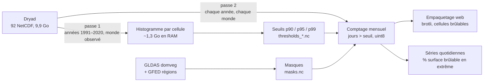

# 00 : Vue d'ensemble du pipeline

> Objectif : produire, à partir de ~10 Go de NetCDF quotidiens, quelques dizaines de Mo
> que le navigateur peut animer, sans trahir la science derrière.

## Ce que l'on visualise

Pas « le nombre d'incendies », mais **la météo propice aux incendies** : le *Fire Weather
Index* (FWI) du système canadien, calculé chaque jour sur une grille mondiale de 0,25°
(~28 km à l'équateur) à partir de la température maximale, de l'humidité minimale, du vent
et des précipitations de la réanalyse ERA5. Deux mondes sont comparés :

| Monde | Contenu | Source |
|---|---|---|
| **observé** | FWI recalculé sur ERA5 | Yin et al. 2026, fichiers `fwi_era5_YYYY.nc` |
| **contrefactuel** | même chose après retrait du signal de réchauffement anthropique (moyenne de 20 modèles CMIP6, référence 1850–1900, lissé sur 20 ans) | fichiers `fwi_era5_counter_YYYY.nc` |

Un jour est « extrême » dans une cellule quand son FWI dépasse le **90ᵉ percentile local
calculé sur 1991–2020** (définition de l'article). Le même seuil est appliqué aux deux
mondes : c'est ce qui rend la comparaison lisible. Nous calculons aussi p95 et p99 pour les
paliers visuels.

## Les deux passes

Le volume interdit de tout charger en mémoire : 46 ans × 365 jours × 1 038 240 cellules
≈ 17 milliards de valeurs par monde. Le pipeline lit donc chaque fichier **une fois par
passe**, jour après jour, sans jamais matérialiser plus de 32 jours à la fois.



1. **Passe 1 : seuils** (`earthburns thresholds`) : un histogramme à classes fixes par
   cellule, alimenté jour après jour, dont on déduit les percentiles avec une erreur bornée
   par la largeur des classes. Détail : [03-thresholds.md](03-thresholds.md).
2. **Masques** (`earthburns mask`) : quelles cellules sont « brûlables » (forêts, savanes,
   arbustes, prairies…) et à quelle région GFED elles appartiennent.
   Détail : [02-grid-and-masks.md](02-grid-and-masks.md).
3. **Passe 2 : comptage** (`earthburns monthly`) : pour chaque mois, chaque cellule et
   chaque seuil, le nombre de jours au-dessus du seuil (un octet), plus, pour chaque jour,
   la fraction de surface brûlable en météo extrême, globale et par région.
   Détail : [04-monthly-and-extent.md](04-monthly-and-extent.md).
4. **Empaquetage** (`earthburns pack`) : uniquement les cellules brûlables, images
   mensuelles, compressées en brotli par décennie. Détail : [05-web-packing.md](05-web-packing.md).

## Arborescence

```
config/pipeline.toml      paramètres (chemins, années, quantiles, classes brûlables)
earthburns/               le paquet Python
  grid.py                 grille canonique 721×1440, poids cos(lat), réorientation
  fwi_io.py               lecture paresseuse des NetCDF, itération par jour
  histogram.py            histogramme en flux + percentiles
  thresholds.py           passe 1 (orchestration + validation)
  mask.py / build_mask.py masque brûlable + régions GFED
  monthly.py / monthly_run.py  passe 2
  extent.py               fractions de surface pondérées
  pack.py                 encodage web
  dryad.py / cli_dryad.py client Dryad (manifeste, reprise, SHA-256)
  cli.py                  commandes
tests/                    57 tests unitaires et d'intégration (pytest)
data/                     jamais versionné : raw/ → interim/ → processed/ → web/
```

## Choix qui structurent tout le reste

- **Grille canonique** : latitude de +90 à −90, longitude de −180 à +179,75. Tout tableau
  produit par le pipeline a cette orientation, ce qui permet d'aligner masques, seuils et
  journées cellule à cellule sans réindexation.
- **Immutabilité sauf accumulateurs** : les fonctions renvoient de nouveaux tableaux ;
  seuls l'histogramme et le compteur mensuel se mettent à jour en place, parce que c'est ce
  qui permet de tenir en mémoire.
- **Échec rapide** : fichier manquant, grille inattendue, année incomplète, somme de
  contrôle fausse → exception, jamais de valeur par défaut silencieuse.

## Sources principales

- Yin C., Abatzoglou J. T., Jones M. W. et al., *Increasing synchronicity of global extreme
  fire weather*, Science Advances, 18 février 2026, doi:[10.1126/sciadv.adx8813](https://doi.org/10.1126/sciadv.adx8813).
- Dataset associé : Dryad doi:[10.5061/dryad.cfxpnvxkp](https://doi.org/10.5061/dryad.cfxpnvxkp) (CC0).
- Van Wagner C. E., *Development and structure of the Canadian Forest Fire Weather Index
  System*, Forestry Technical Report 35, 1987 (la définition du FWI).
